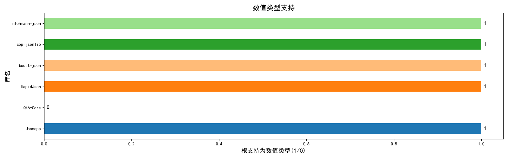
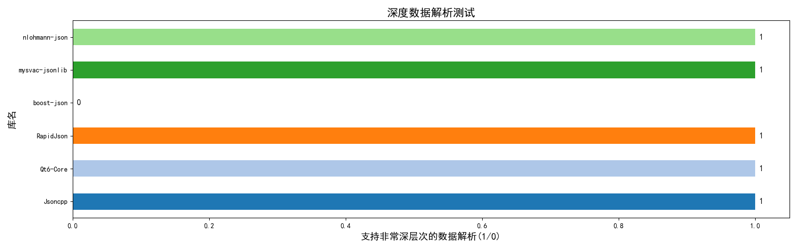
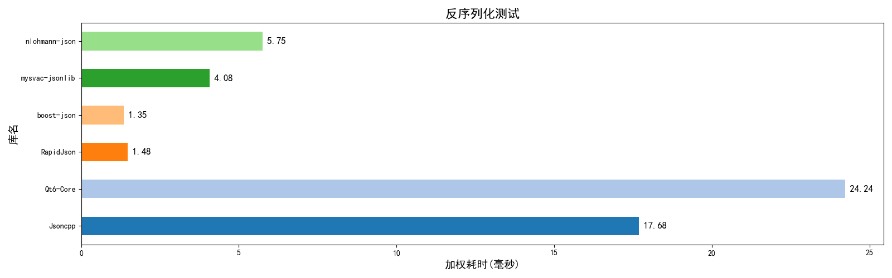
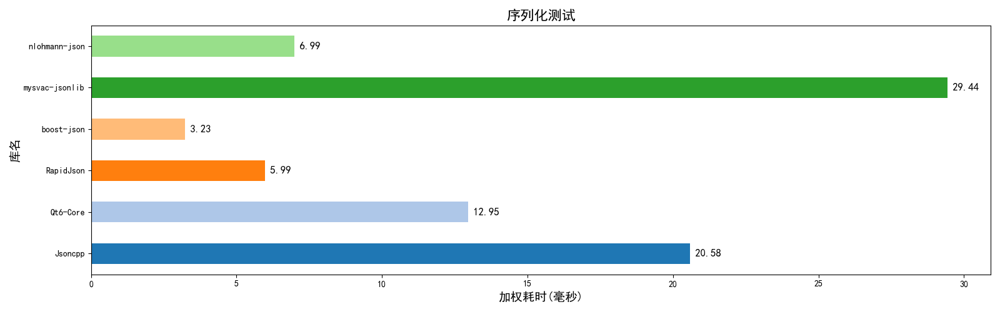
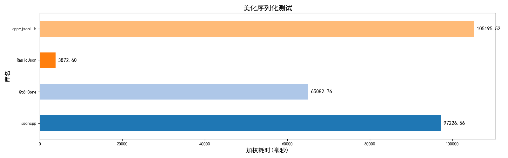
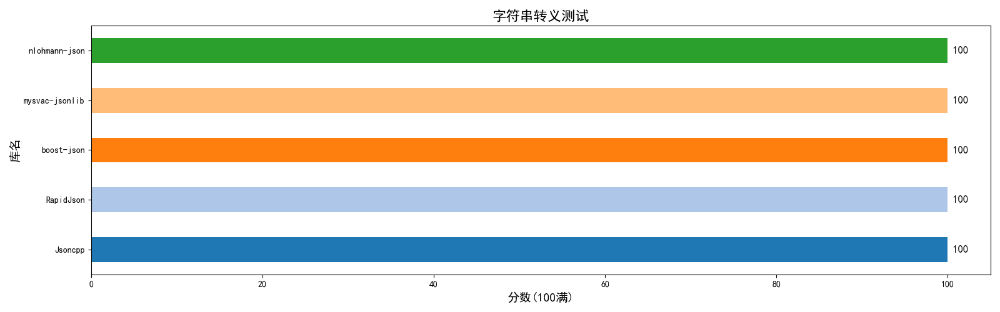
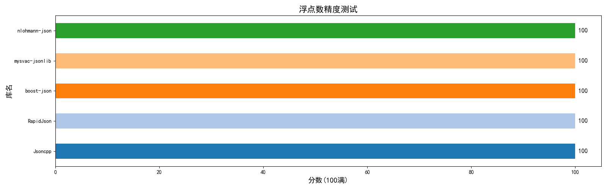
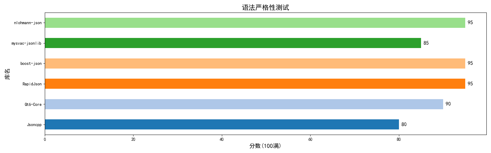

# C++ JSON库 测试框架

## 项目概要
C++17 JSON解析库测试框架。

使用现代C++，保证程序内存安全，跨平台。

提供 **解析速度，内存占用，浮点精度，字符串转义，语法严格性，增删改查** 等多项测试内容。

提供测试报告和结果数据表格，提供工具生成测试对比图。

## 项目介绍
### 基本说明
1. 框架采用C++17，框架本身仅依赖标准库和`boost-process`。
2. 项目构建使用`CMake`，搭配`CMakePreset`，完全跨平台。
3. 第三方库管理，默认使用`vcpkg`，可以自行修改`CMakePreset`调整。
4. 内存测试依赖`boost-process`，可以修改`CMakeLists.txt`关闭内存测试，关闭后不再依赖`boost-process`。
5. Qt测试依赖`qtbase`，库太大，默认不下载，需要自行配置库目录。 若不需要，可删除此测试和相关依赖导入。

### 工作原理概要


TestBase的子类，也就是各库的测试代码文件，统一放在`test_codes/`目录下。

新增测试类，直接添加cpp文件即可，无需修改主函数和CMake等配置。<br>
（仅`test_codes/`文件夹下的`.cpp`文件，不递归扫描，因此不编译`test_codes/models/`下的文件。）

注：若`test_codes/`下没有任何文件，也就没有注册任何测试类。 主程序依然能正常运行，但是输出的报告中不含任何测试结果。


### 如何导入新的库
下面提供3种方式：
1. 使用vcpkg安装第三方库，推荐清单模式，使用`vcpkg add port 包名`添加。然后在`CMakeLists.txt`中使用`find_package`和`target_link_libraries`即可。
2. 直接放源码。将头文件放入`include`文件夹，将源文件放入`src`文件夹即可，项目构建/生成时会把这些代码也加入构建/编译生成。
3. 使用vcpkg的custom-overlay模式，添加自定义位置的第三方库，推荐看官方示例。


### 如何测试新的库
根据上述的工作原理，你只需要写一个`.cpp`文件，导入头文件`model_class.h`和你的库的头文件。

内部写一个子类继承`TestBase`接口并实现全部纯虚函数，最后通过宏注册即可。

`test_codes/`文件夹下有一些现成的代码，`test_codes/models/`文件夹中提供了一些参考代码。

### 项目构建与编译
如果你有CMake基础，可以看看`CMakeLists.txt`和`CMakePresets.json`，项目结构其实非常简单。

根据自己的情况，调整一下`CMakePresets.json`，然后选择合适的预设选项，使用
```shell
cmake --preset <configure-preset-name>
cmake --build --preset <build-preset-name>
```
就能配置和生成。（推荐Release模式，Debug模式下栈空间消耗大，深层递归解析测试可能失败。）

### 使用测试结果
前置： 完成上述步骤并运行可执行程序。

测试完成后，各种数据将放在`result/`文件夹下，这里有3大内容：
1. `result/reports/`文件夹，存放各库的测试错误报告（部分错误并无危害，是正常的）。
2. `result/result.csv`文件，存放着各库 各测试项目的具体分数。
3. `get_chart_**.py`Python程序，用于读取`result.csv`并生成图表。

请进入`result/`文件夹，然后执行`python get_chart_zh.py`命令即可。<br>
图片将生成在`result/images_zh/`文件夹中。


### 注意事项
1. `test_codes/`文件夹下存放测试类代码，不会递归查询，所以`test_codes/models`内的代码不会被编译。
2. `test_codes/`文件夹即使全删，程序依然能正常运行。不想要什么测试，删了就行。
3. 如果删除了测试文件，记得修改`CMakeLists.txt`和`vcpkg.json`，删除项目的库依赖，不然还会下载。
4. Qt测试默认使用本地Qt，需要自行设置CMake预设，指定位置。（`qtbase`库太大，保护大量不相关内容，不推荐vcpkg下载）。
5. `custom-overlay/`文件夹，存放的是自定义vcpkg库目标，用于安装`mysvac-jsonlib`库，不需要的话可以删除。

## 效果例图
目前仅比较如下几个库，各有优劣（Release下）：
1. rapidjson 操作非常繁杂，解析与操作极快，内存占用很低，性能极佳。
2. boost-json 操作简单，现代，会抛出异常，性能极佳。 
3. Qt 操作难度中等，值类型的直接解析 支持性较差，性能中等。
4. jsoncpp 操作非常简单，现代，不抛出异常，性能略差。
5. mysvac-jsonlib 操作非常简单，现代，会抛出异常，性能略差。 
6. nlogmann-json 操作非常简单，现代，会抛出异常，性能较好。













