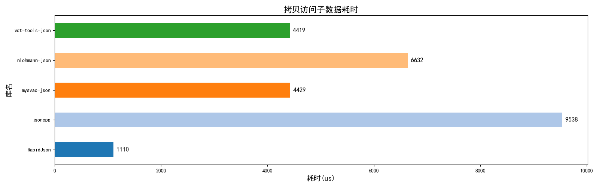

# C++ JSON库 测试框架

> 效果图在最下方。

## 项目概要

C++23 JSON解析库测试框架。

使用现代C++，保证程序内存安全，跨平台。

提供 **基础有效性验证、序列化测速度、反序列化测试、增删改查测试、内存占用** 等多项测试内容。

提供测试报告和结果数据表格，提供工具生成测试对比图。

## 项目介绍

### 基本说明

1. 框架采用C++23，框架本身仅依赖标准库。
2. 项目构建使用`CMake`，搭配`CMakePreset`，完全跨平台。
3. 第三方库管理，默认使用`vcpkg`，可以自行修改`CMakePreset`调整。

### 如何导入新的库
下面提供3种方式：
1. 使用vcpkg安装第三方库，推荐清单模式，使用`vcpkg add port 包名`添加。然后在`CMakeLists.txt`中使用`find_package`和`target_link_libraries`即可。
2. 直接放源码。将头文件放入`include`文件夹，将源文件放入`src`文件夹即可，项目构建/生成时会把这些代码也加入构建/编译生成。
3. 使用vcpkg的custom-overlay模式，添加自定义位置的第三方库，推荐看官方示例。

### 工作原理概要


TestBase的子类，也就是各库的测试代码文件，统一放在`src/libs/`目录下。

### 如何测试新的库

根据上述的工作原理，你只需要写一个`.cpp`文件，编写子类并将其注册到全局单例。

`docs` 文件夹中提供了一份 `model_zh.cpp` 模板，将其复制到 `src/libs/` 目录下，重命名为 `你的库名.cpp`，然后根据注释修改代码，即可自动实现功能测试。

### 项目构建与编译

如果你有CMake基础，可以看看`CMakeLists.txt`和`CMakePresets.json`，项目结构其实非常简单。

根据自己的情况，调整一下`CMakePresets.json`，然后选择合适的预设选项：

```shell
cmake --preset <configure-preset-name>
cmake --build --preset <build-preset-name>
```

请使用 Release 模式以保证测试结果可信，深层递归解析测试可能失败。

### 使用测试结果

完成上述步骤并运行可执行程序。

测试完成后，各种数据将放在`result/`文件夹下，这里有两大大内容：

1. `result/result.csv`文件，存放着各库各测试项目的具体分数。
2. `get_chart_**.py`Python程序，用于读取`result.csv`并生成图表。

请进入`result/`文件夹，然后执行`python get_chart_zh.py`命令即可。<br>
图片将生成在`result/charts_zh/`文件夹中。

### 注意事项

1. 项目中有一个 `vct-tools-json` 库，此库将作为测试基准。
2. src 中的文件是递归解析的，可以自定义文件夹结构。
3. 现有测试文件（`src/libs/`中的文件）可以删除，即使全删也能运行程序。
4. 如果删除了测试文件，记得修改`CMakeLists.txt`和`vcpkg.json`，删除项目的库依赖。

## 效果例图





