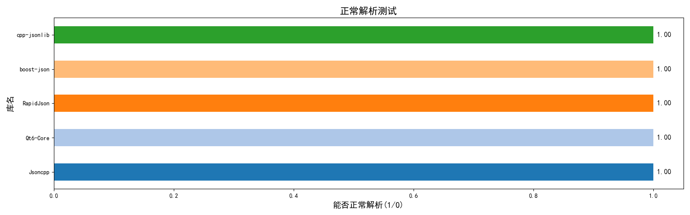
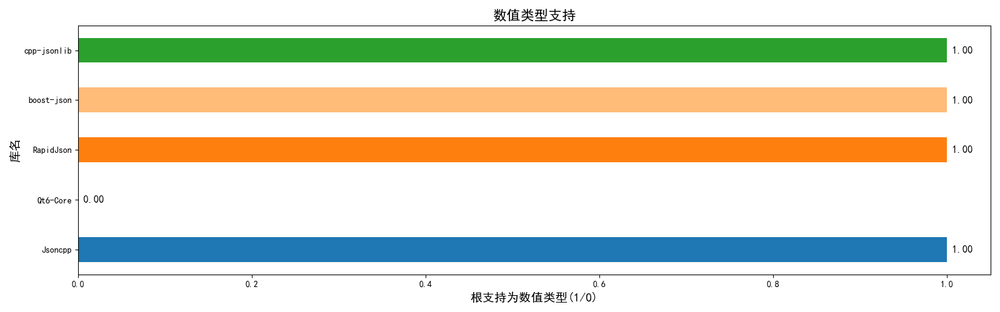
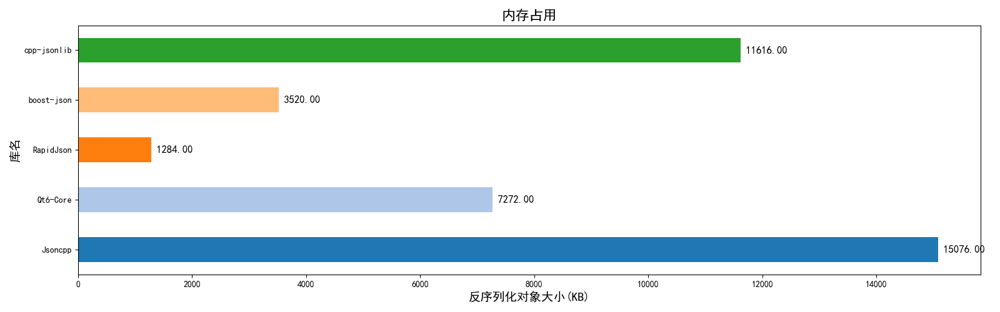
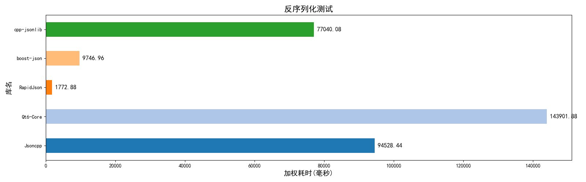
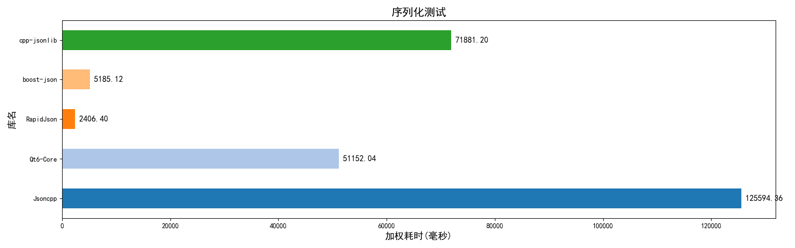
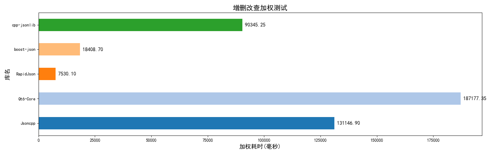
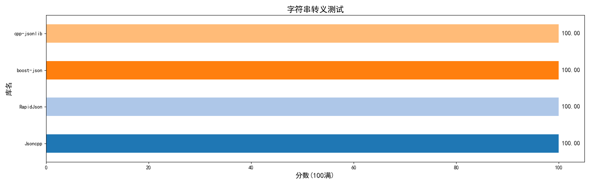
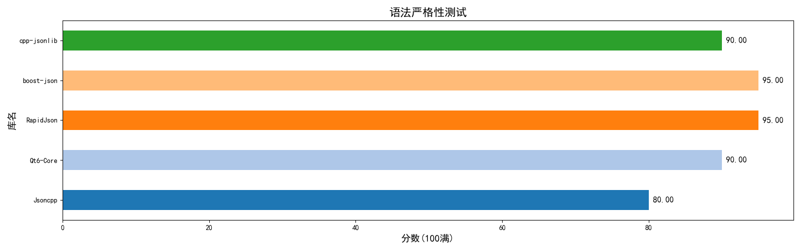

# C++ JSON库 测试框架

## 项目概要
C++17 JSON解析库测试框架。

使用现代C++，保证程序内存安全，跨平台。

提供 **解析速度，内存占用，浮点精度，字符串转义，语法严格性，增删改查** 等多项测试内容。

提供测试报告和结果数据表格，提供工具生成测试对比图。

## 项目说明
### 基本说明
1. 框架采用C++17，框架本身仅依赖标准库和`boost-process`。
2. 项目构建使用`CMake`，搭配`CMakePreset`，完全跨平台。
3. 第三方库管理，默认使用`vcpkg`，可以自行修改`CMakePreset`调整。
4. 内存测试依赖`boost-process`，可以修改`CMakeLists.txt`关闭内存测试，关闭后不再依赖`boost-process`。

### 工作原理概要
`model_class.h`中定义了一个`TestBase`类，是测试类的接口。程序通过这个类的对象，调用内部函数，进行测试。

`model_class.h`中声明了一个全局单例，存储全部测试类的实例对象。末尾提供了一个宏，用于注册测试类，也就是自动生成测试类的实例对象，并放入这个单例。

主函数会获取这个单例，遍历内部的所有对象，并通过统一的测试内容进行测试，最后输出错误报告和统计表格。

内存测试通过`PROJECT_USE_BOOST_PROCESS`宏控制，如果此宏被定义，则导入`boost-process`库并进行内存测试。<br>
可以修改`CMakeLists.txt`，删除相关的 库导入和宏定义 来删除此宏。 关闭后程序不将再依赖`boost-process`库，无需下载。<nr>
（不进行内存测试，但正常进行其他测试。）

注：如果`test_codes/`下没有测试类文件，也就没有注册任何测试类。 主程序依然能正常运行，但是输出的报告中不含任何测试结果。

### 如何测试新的库
根据上述的工作原理，你只需要写一个`.cpp`文件，导入头文件`model_class.h`，内部写一个子类继承并实现`TestBase`接口，最后通过宏注册即可。

`test_codes/`文件夹下有一些现成的代码，`test_codes/models/`文件夹中提供了一些参考代码。

具体使用，请看下方的"编写测试类文件"。

### 项目构建与编译
如果你有CMake基础，可以看看`CMakeLists.txt`和`CMakePresets.json`，项目结构其实非常简单。

根据自己的情况，调整一下`CMakePresets.json`，然后选择合适的预设选项，使用
```shell
cmake --preset <configure-preset-name>
cmake --build --preset <build-preset-name>
```
就能配置和生成。


### 如何导入新的库
下面提供3种方式：
1. 使用vcpkg安装第三方库，推荐清单模式，使用`vcpkg add port 包名`添加。然后在`CMakeLists.txt`中`find_package`和`target_link_libraries`即可。
2. 直接放源码。将头文件放入`include`文件夹，将源文件放入`src`文件夹即可，项目构建时会把这些代码也加入构建。
3. 使用vcpkg的custom-overlay模式，添加自定义位置的第三方库，推荐看官方示例。

库添加后，请在`test_codes/`文件中新建cpp文件，编写测试子类并用宏注册。

## 添加自己的测试类文件和生成结果图

0. 如果需要导入依赖，请先看上方的"如何导入新的库"。
1. 进入`test_codes/`文件夹，删除不需要的测试文件。
2. 复制一份`test_codes/models/model_zh.cpp`模板文件，到`test_codes/`文件夹中，文件名可以随便改（.cpp后缀不能改）。
3. 打开此文件，根据注释，再参考其他几个库已经写好的测试模板，自行填写内容。
4. 填写完整后，无需修改其他内容，直接构建项目并运行即可。
5. 错误报告和最终结果会在`result/`文件夹下。
6. 进入`result/`文件夹，执行python程序`get_chat_zh.py`即可生成对比图。


## 注意事项
1. 主程序不依赖任何外部库，不需要的库，记得删除vcpkg端口和CMakeLists.txt中的查找链接。
2. `test_codes/`文件夹下存放测试类代码，不会递归查询，所以`test_codes/models`内的代码不会被编译。
3. `test_codes/`文件夹即使全删，程序依然能正常运行，不想要什么测试，删了就行。
4. Qt不建议使用vcpkg安装，请使用CMake预设指定本机中QT的位置。还需要手动复制动态库文件，才能运行。
5. `custom-overlay/`文件夹，存放的是自定义vcpkg库目标，用于安装`cpp-jsonlib`库，不需要的话可以删除。
6. 内存测试依赖`boost-process`库。如果修改了`CMakeLists.txt`关闭了内存测试，记得vcpkg也删除相关依赖。

## 效果例图
目前仅比较4个库，各有优劣（O2优化）：
1. rapidjson 极快，内存占用也低，但是真的难用。
2. Qt 用起来比rapidjson稍微好点，但是对值类型作为根元素，支持性不好。
3. jsoncpp 操作非常简单，现代，性能就差了点。
4. cpp-jsonlib 操作非常简单，现代，唯一会抛出异常的库，性能也差了点。 













